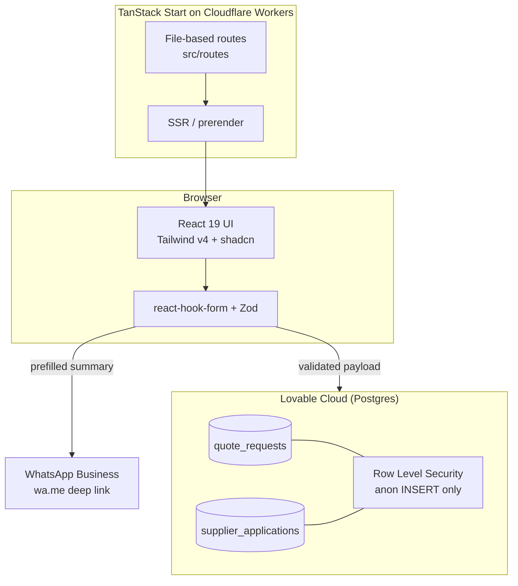
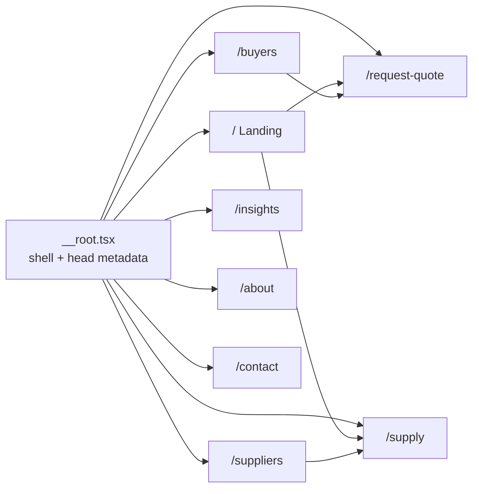
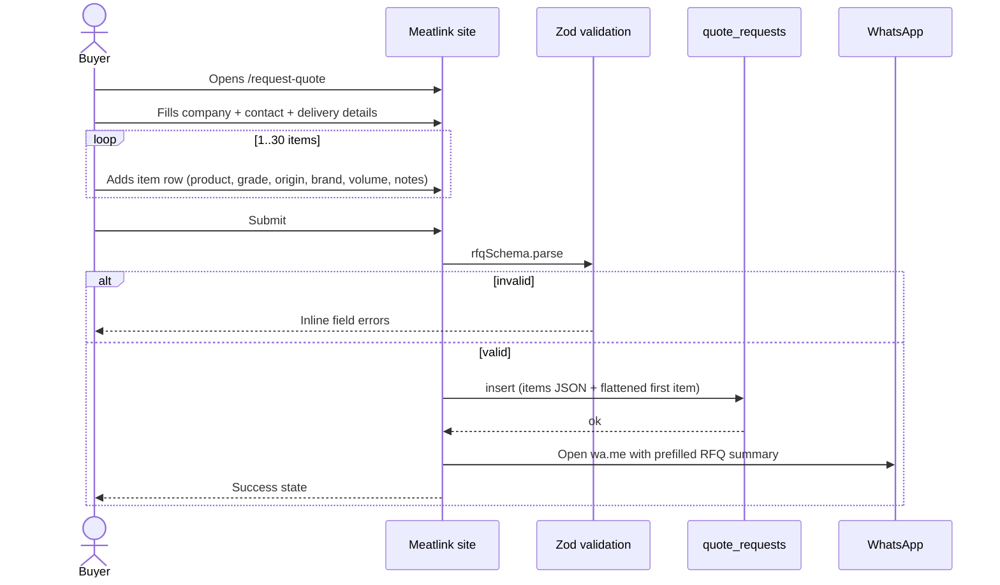
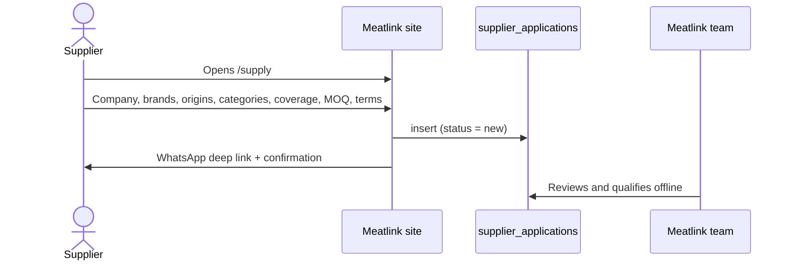
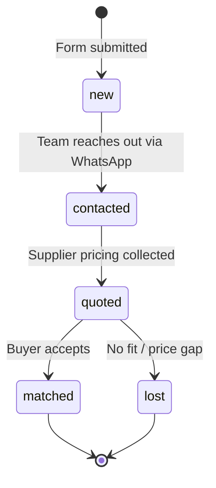
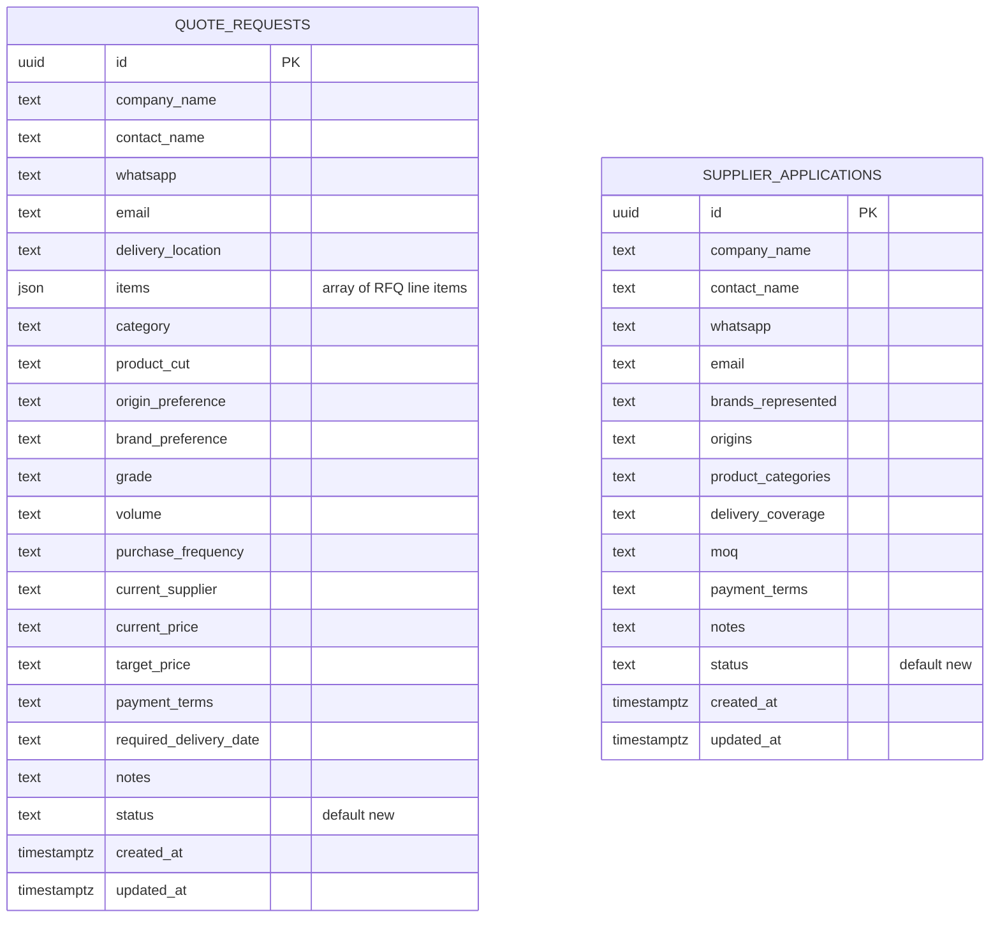
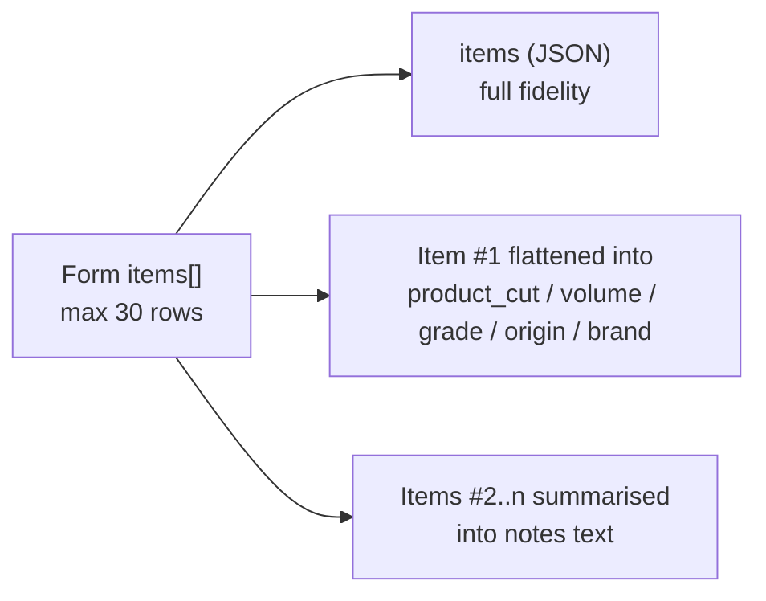
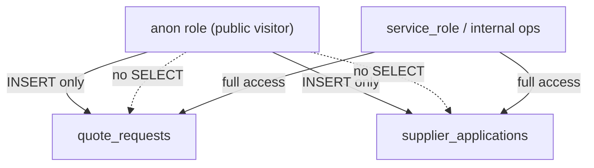

# Meatlink.id — Better Meat · Better Connections

Meatlink.id is a premium **B2B meat sourcing network** for Indonesia. It is not a
storefront: buyers (HORECA, hotels, distributors, retail) submit a **Request for
Quote (RFQ)**, suppliers apply to join the network, and the Meatlink team matches
them offline over WhatsApp.

- **Live app**: https://meatlink.id
- **Preview**: https://meathub-production-hub.lovable.app
- **Contact**: cs@meatlink.id · WhatsApp +62 897-8872-745

---

## 1. Product overview

| Aspect | Detail |
| --- | --- |
| Model | Lead generation / brokered sourcing (no online checkout) |
| Primary action | Multi-item RFQ submission |
| Secondary action | Supplier network application |
| Coverage | Nationwide (Seluruh Indonesia) |
| Categories | Beef, Wagyu, Lamb, Poultry, Seafood |
| Follow-up channel | WhatsApp Business + email |
| Language | English |

### What the product is *not*
No cart, no payments, no vendor dashboards, no order lifecycle. The earlier
marketplace build (MEATHUB) was fully removed in favour of this focused
lead-capture site.

---

## 2. High-level architecture



### Stack

| Layer | Technology |
| --- | --- |
| Framework | TanStack Start v1 (TanStack Router, SSR) |
| Build | Vite 7 |
| UI | React 19, Tailwind CSS v4, shadcn/ui, lucide-react |
| Forms | react-hook-form + Zod resolvers |
| Data | Lovable Cloud (Postgres) via the generated client |
| Runtime | Cloudflare Workers (edge) |
| Fonts | Playfair Display (display), Archivo (sans) |

---

## 3. Route & screen map



| Route | File | Purpose |
| --- | --- | --- |
| `/` | `src/routes/index.tsx` | Editorial hero, sourcing process, categories, recently sourced, dual CTA |
| `/buyers` | `buyers.tsx` | Buyer value proposition, segments served |
| `/suppliers` | `suppliers.tsx` | Supplier value proposition, partnership criteria |
| `/request-quote` | `request-quote.tsx` | Multi-item RFQ form (main conversion) |
| `/supply` | `supply.tsx` | Supplier network application form |
| `/insights` | `insights.tsx` | Market notes / editorial content |
| `/about` | `about.tsx` | Company positioning |
| `/contact` | `contact.tsx` | WhatsApp + email channels |

Shared shell: `site-layout.tsx`, `site-header.tsx`, `site-footer.tsx`.

---

## 4. Core user journeys

### 4.1 Buyer RFQ flow



### 4.2 Supplier application flow



### 4.3 Lead lifecycle (operational)



`status` is a text column defaulting to `new`; transitions are performed by the
team, not by the public site.

---

## 5. Data model



The two tables are intentionally **unrelated** — each row is a standalone lead.

### Multi-item RFQ storage

Customer feedback ("hard to order many products") drove a multi-item form. Storage
keeps backwards compatibility:



| Field | Required | Max |
| --- | --- | --- |
| `product_cut` | yes | 160 |
| `volume` | yes | 120 |
| `category`, `origin_preference`, `brand_preference`, `grade` | no | 60–120 |
| `notes` (per item) | no | 300 |
| items per RFQ | — | 30 |

---

## 6. Security model



- RLS enabled on both tables; the public site can create leads but never read them.
- No authentication surface is exposed — there are no accounts on the site.
- All input is length-capped and validated with Zod before insert.
- Publishable keys only in client code; no secrets in the bundle.

---

## 7. Design system

Defined entirely as tokens in `src/styles.css` (Tailwind v4 `@theme`).

| Token | Value | Usage |
| --- | --- | --- |
| `noir` | `#0D0D0D` | Hero and footer surfaces |
| `ink` | `#141414` | Primary text |
| `bone` | `#F7F4F0` | Page background |
| `sand` | `#EDE8E2` | Alternate band |
| `crimson` | `#A3212C` | CTAs, eyebrows, rules |
| `ash` | `#6B6560` | Secondary text |
| `line` | `#DCD6CE` | Hairline borders |

Custom utilities: `eyebrow` (uppercase tracked label), `rule-crimson` (accent
underline), `fade-in-up` (entrance animation). Never hardcode colour utilities —
use the semantic tokens so theming stays consistent.

---

## 8. Project structure

```text
src/
├── routes/                 file-based routes (one file per screen)
│   ├── __root.tsx          shell, fonts, global head metadata
│   └── *.tsx               public pages
├── components/
│   ├── site/               header, footer, layout, RFQ + supplier forms, form-kit
│   └── ui/                 shadcn primitives
├── lib/meatlink/
│   ├── config.ts           WhatsApp number, email, categories, showcase data
│   └── leads.ts            Zod schemas, insert helpers, WhatsApp message builders
├── integrations/supabase/  generated client + types (do not edit)
└── styles.css              design tokens and base layer
```

### Key modules

| Module | Responsibility |
| --- | --- |
| `lib/meatlink/config.ts` | Single source of truth for contact channels and category copy |
| `lib/meatlink/leads.ts` | `rfqSchema`, `supplierSchema`, `submitRfq`, `submitSupplier`, WhatsApp message builders |
| `components/site/rfq-form.tsx` | Dynamic item rows, validation, submit + WhatsApp handoff |
| `components/site/supplier-form.tsx` | Supplier application capture |
| `components/site/form-kit.tsx` | Shared labelled inputs / textareas styled to the design system |

---

## 9. Local development

```sh
git clone <this-repository-url>
cd <repository-name>
npm i
npm run dev        # http://localhost:8080
```

| Script | Purpose |
| --- | --- |
| `npm run dev` | Vite dev server with SSR |
| `npm run build` | Production build for the edge runtime |
| `npm run build:dev` | Development-mode build (prerender check) |
| `npm run preview` | Serve the production build locally |
| `npm run lint` | ESLint |
| `npm run format` | Prettier |

Environment variables for the backend client are generated automatically; do not
edit `.env` or files under `src/integrations/supabase/`.

---

## 10. Operational notes

- **Response SLA**: leads are followed up manually via WhatsApp; keep the number in
  `config.ts` in sync with the live Business line.
- **Changing contact details**: edit `src/lib/meatlink/config.ts` only — header,
  footer, contact page and both forms read from it.
- **Adding a category**: append to `CATEGORIES` in `config.ts`; the landing page
  grid renders from that array.
- **SEO**: every route defines its own `head()` with unique title, description and
  Open Graph tags. Keep titles under 60 characters and descriptions under 160.

---

## 11. Roadmap (not built yet)

| Item | Status |
| --- | --- |
| Internal lead inbox / admin console | Planned |
| Supplier directory with verified badges | Planned |
| Automated quote comparison | Exploratory |
| Insights content pipeline (CMS) | Exploratory |

---

Built with [Lovable](https://lovable.dev). Every change made in the Lovable editor
is committed straight to this repository, and pushes to `main` sync back in.
